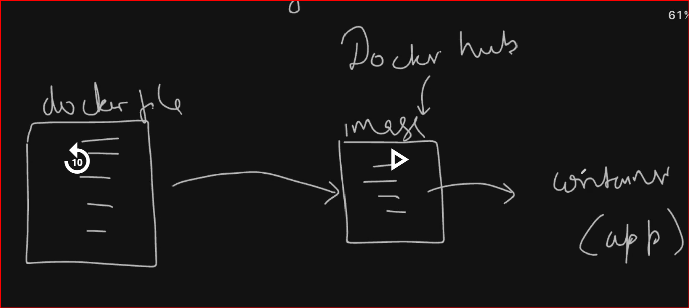
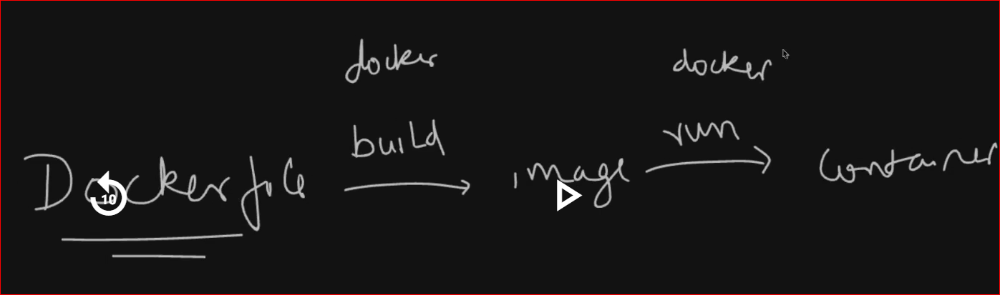
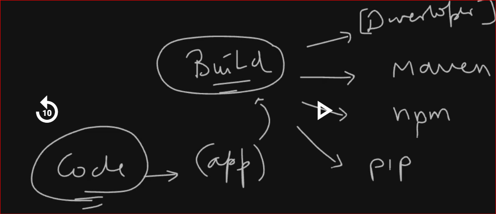
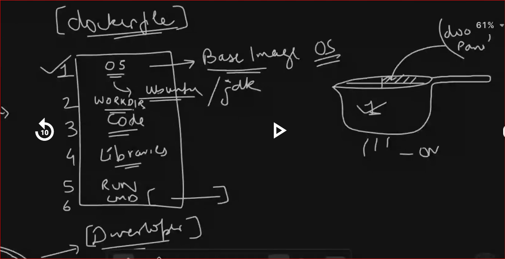
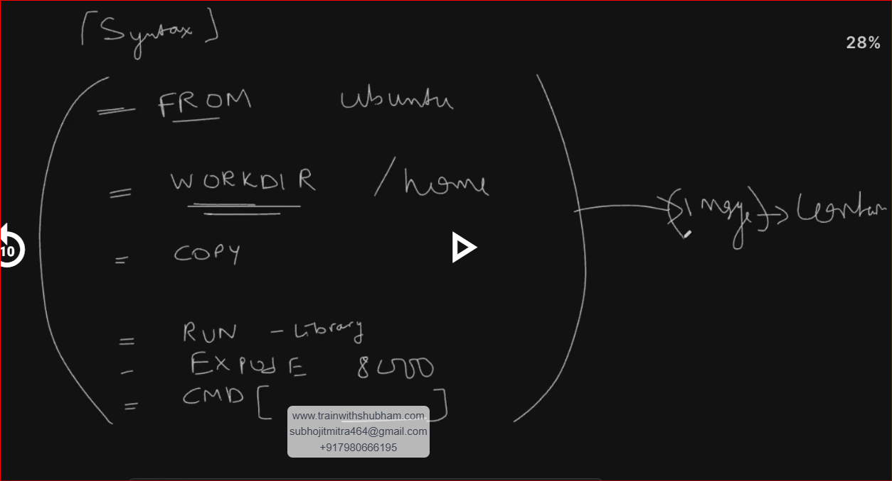

**To check version:**
docker --version

**To add current logged user to docker group:**
usermod -aG docker $USER

**To refresh the group:**
newgrp docker

**To check docker process:**
docker ps

**Visual representation for creating container:**

**Create an account in DockerHub:**
**Create a PAT**
Login to DockerHub:
docker login
username:
password:

***How to create container from Image pulled from DockerHub:***

**To run nginx container:**

docker run -it ubuntu
docker run -d -p 80:80 nginx

**To Stop Container:**
docker stop <container ID>

**To start container:**
docker start <container ID>

***How to create a container from a Dockerfile***

**We should know which build tool required for creating a Dockerfile**

**To check stop container**
docker ps -a

**To remove stopped container**
docker rm <containerID>

**To remove all stopped container**
docker system prune

