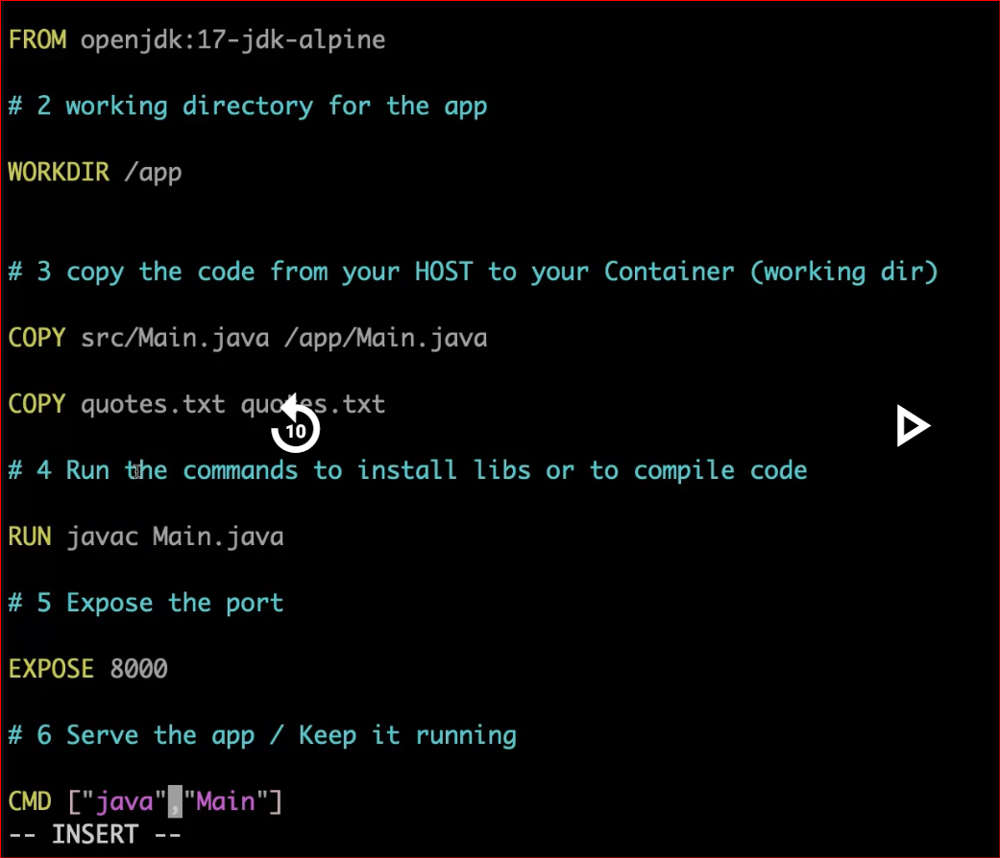

**Clone the repo**

git clone https://github.com/subhomit-sudo/java-quotes-app.git

**Create a Dockerfile**

**Build the image**

docker build -t java-quotes:latest .

**Check the image**

docker images

**Run docker image to create container**

docker run -d -p 8000:8000 --name java-quotes-app java-quotes:latest

**Make the open port number 8000 in SC group**\

**Check with PublicIP:8000 in browser**
