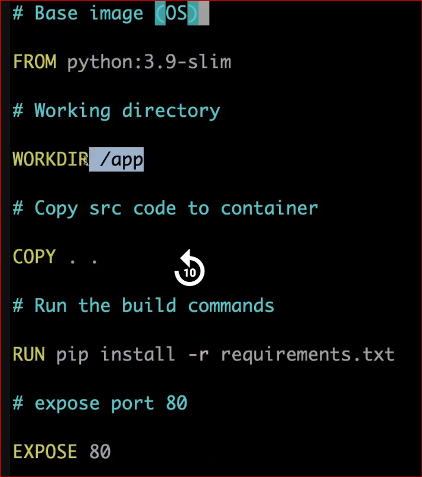
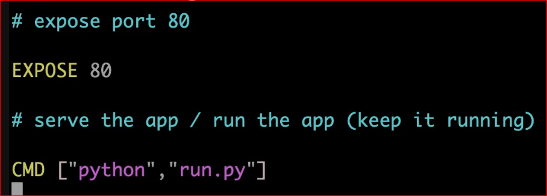

**Clone the repo**

git clone https://github.com/subhomit-sudo/flask-app-ecs.git

**Flask is a python Framework**

**Create a Dockerfile**

**Build the image**

docker build -t python-app:latest .

**Check the image**

docker images

**Run docker image to create container**

docker run -d -p 80:80 --name python-app python-app:latest

**Make the open port number 80 in SC group**

**Check with PublicIP:80 in browser**

**If not running check logs**

docker logs <#containerID>

**google the error and add the library in requirements.txt**

Werkzeug==2.2.2

======================================================

**You can edit app.py file with random texts and again build the image and run the container**

**You can check server health by running PublicIP:80/health in browser**
