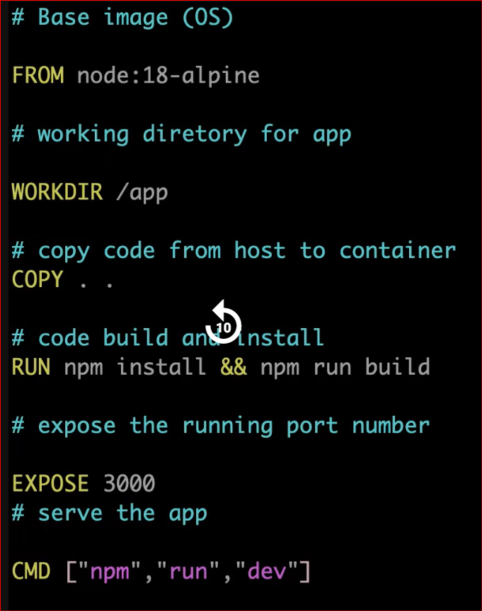

============================================
⚛️ React 18
React is a JavaScript library for building user interfaces, especially single-page applications (SPAs). React 18 is a major version that introduced several new features:

🔑 Key Features of React 18:
Concurrent Rendering: Allows React to interrupt rendering to prioritize more important updates.
Automatic Batching: Groups multiple state updates into a single re-render for better performance.
useTransition Hook: Helps manage UI transitions smoothly.
Streaming Server-Side Rendering (SSR): Improves performance for server-rendered apps.
startTransition API: Marks updates as non-urgent to keep the UI responsive.
🌐 Next.js
Next.js is a React framework built on top of React. It adds powerful features for building production-ready web apps.

🚀 Key Features of Next.js:
File-based Routing: Pages are created by adding files to the pages/ directory.
Server-Side Rendering (SSR) and Static Site Generation (SSG): Improves SEO and performance.
API Routes: Build backend endpoints directly in the same project.
Image Optimization: Built-in support for optimized images.
Middleware and Edge Functions: Run code closer to the user for faster response times.
App Router (from Next.js 13+): A new routing system with React Server Components support.

===============================================

**Clone the repo**

git clone https://github.com/subhomit-sudo/community_portfolio.git

**Create a Dockerfile**

**Build the image**

docker build -t portfolio-app:latest .

**Check the image**

docker images

**Run docker image to create container**

docker run -d -p 3000:3000 --name portfolio-app portfolio-app:latest

**Make the open port number 3000 in SC group**

**Check with PublicIP:3000 in browser**

**If not running check logs**

docker logs <containerID>

======================================================

**You can edit app/components/hero-section/Hero.tsx file with your name and again build the image and run the container**

