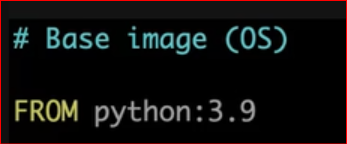
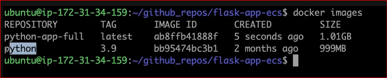
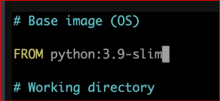
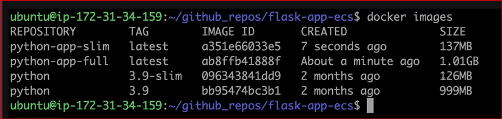
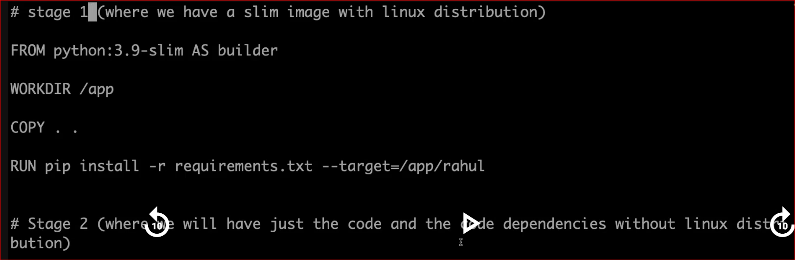
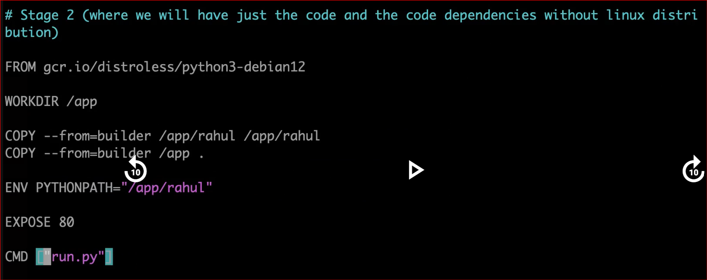
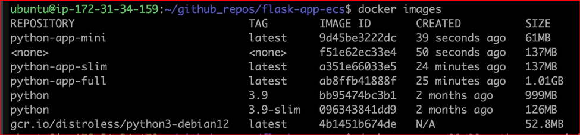

# What is Distroless image?

```bash
"Distroless" images contain only your application and its runtime dependencies. 
They do not contain package managers, shells or any other programs you would 
expect to find in a standard Linux distribution.
```

## Building Docker Image
```bash

First check what is the size of docker image of flask-app-ecs project.(only python:3.9 image)

* docker build -t python-app-full .
```




```bash
You can see the size of python:3.9 image is around 1GB that is a big size, as a devops eng we need to optimize this size.

```



## Now we need to edit the Base image as python:3.9-slim.
```bash

* docker build -t python-app-slim .
```



```bash
Check the size of slim image. It is around 137MB. We need to optimize more, here comes to picture distroless image.
```



## Now we need to create another Docker file as Dockerfile-multi-stage.
```bash
* docker build -f ./Dockerfile-multi-stage -t python-app-mini .

```





```bash
Now check what will be the image size.
```



## Run the container now.
```bash

* docker run -d -p 80:80 python-app-mini:latest

```

# Deleting Docker Images and Containers

```bash
To clean up Docker resources such as images and containers, you can use the following commands:

## Option 1: Prune the system

This command removes all stopped containers, unused networks, dangling images, and build cache:

* docker system prune

## Option 2: Remove all containers and images manually

* docker rm $(docker ps -aq)

* docker rmi $(docker images -aq)

```


